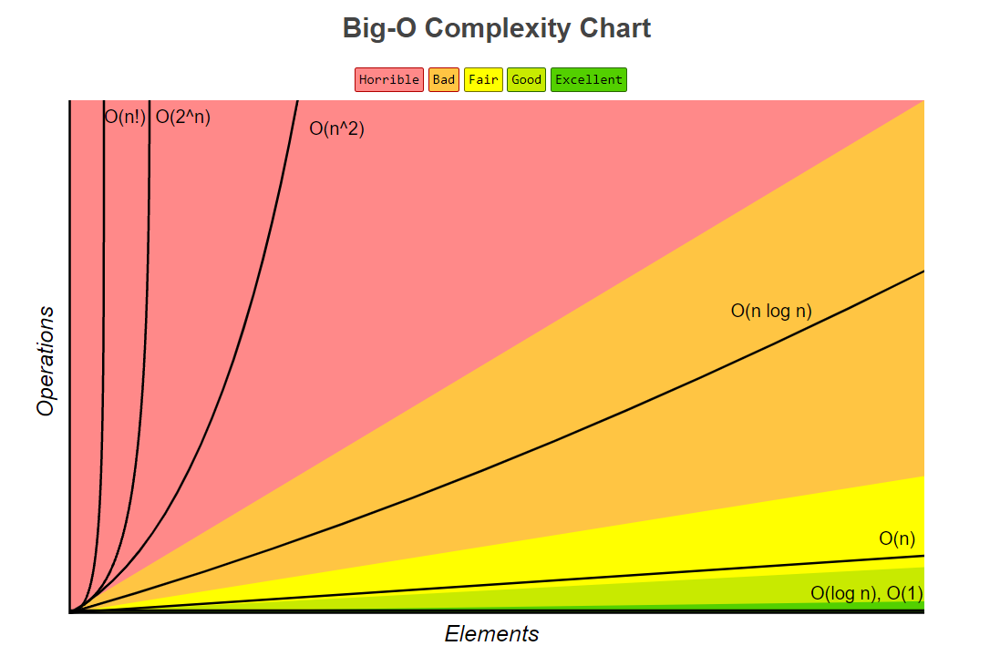

# Algorithm Studies

Procedure or Formula = Algorithm

Objectively Compare:  

* Memory Space  
* Time to Run  

 

## Best Case, Worse Case, and Expected Case

Cases very based on size of data and feature requirements. For a complete table with graphs review [Big O Cheatsheet](https://www.bigocheatsheet.com/)

* Often the expected and worst cases are the same.
* It's not usual to talk about best case as we could specify perfect data to ensure O(1).

 

*Specifically looking at* **quick sort**

 

**Best Case**

O(n), quick sort iterates exactly once over the set. This could happen if the "piviot" is always lower or if the set is already sorted. 

**Worst Case**

O(n^2), quick sort is only able to shrink the set by 1 element. This could happen if sent a set in reverse order with the highest ranked element first in the set.

**Expected Case**

O(n log n), the "pivot" is neither always higher or lower on the selection for the set.

 

**Question**

What is the relationship between best/worst/expected case and Big O/Theta/Omega?

**Answer** 

1. Big O describes the best and worst cases for an algorithm.
2. Big O/Theta/Omega refers to the Upper, Lower, and Tight bounds for an algorithm.

 

## Time Complexity

The concept of asymptotic runtime, or big O time.

### Notation Table 
| "O" of ..  | Term Name   | Rating    |
| ---------- | ----------- | --------- | 
| 1          | Constant    | Excellent | 
| log(n)     | Logarithmic | Good      | 
| n          | Linear      | Fair      |
| log(n!)    | Log Linear  | Bad       |
| n log(n)   | Log Linear  | Bad       |
| n^2        | Quadradic   | Horrible  |
| n^3        | Cubic       | Horrible  | 
| 2^n        | Exponetial  | Horrible  |
| n!         | Factorial   | Horrible  |

## Space Complexity

Takes into account the amount of memory an operation consumes and is a parallel concept with Time Complexity.

* To create an array of size n is O(n)  
* To create an array of size nxn is O(n^2).  

Also take into account recursion:

    int sum(int n)
    {
	    if (n <= 0) {
		    return 0;
	    }
	    return n + sum(n - 1);
    }

Given n = 5 we examine that our space complexity becomes O(n) because each call exists on the stack at the same time.

sum(5) + sum(4) + sum(3) + sum(2) + sum(1) + 0

Let's examine the following code:

    int sum(int a, int b)
    {
	    return a + b;
    }

    for (int n = 0; n < 100; ++n)
    {
        printf("%d", sum(n, n));
    }

We see that n = 100, This gives us a O(n) for time complexity, however our space complexity is only O(1) because each call to the stack exists once before executing the next call.

 

## Multipart Algoritms

*When to add and when to multiply*

**Add**

O(A + B)

    int add(int a, int b)
    {
    	int a, b;

    	for (a = 0; a < 10; ++a)
    	{
    		// do something
    	}

    	for (b = 0; b < 10; ++b)
    	{
    		// do something
    	}
    }

**Multiply**

O(A * B)

    int multiply(int a, int b)
    {
    	int a, b;

    	for (a = 0; a < 10; ++a)
    	    for (b = 0; b < 10; ++b)
    	        // do something
    }

In other words:

* If the algorithm follows the pattern "do this, then when done do this", add them.

* If the algorithm follows the pattern "do this for everytime you do that, multiple them.

 

## Amortized Time

Consider an ArrayList. This data structure allows data to be inserted without worrying about running out of space within the array. This is accomplished by doubling the size of the structure when an insert is made at full capacity. 

O(2n)  ==>  It creates a list of 2n size then copies n elements

However, this is only the worst case, the expected case is O(1) where the increase in size is not needed.

This provides us the amortized time because we account for the average time taken for inserts. The insertion of n elements takes O(n) time with an amortized time of O(1).

 

## Log N Runtimes

O(log n) is a common Time Complexity, but what does it look like?

*Specifically looking at* **binary search**

Given:

[1, 5, 8, 9, 11, 13, 15, 19, 21]

Search for 9.

1. 11 <= 9 - False  
2. 5 <= 9 - True  
3. 8 <= 9 - True  
4. 9 == 9 - True
5. return  

Breaking this down, we see that the number of steps we need to take is n / 2. Mathematically this gives us the term "2^k = n" which equates to "log n". 

 

**Question**

What is the base of log?

**Answer** 

* Short Answer: For large enough data sets this doesn't matter! 

* Longer Answer: The differences in bases is a constant factor, for Big O calculations we drop constants.

 

## Recursive Runtimes

Recursive functions with multiple calls will generally have a Big O Time Complexity of O(branches^depth)

Given a Tree-ish structure:

    int f(int n)
    {
    	if (n <= 0)
    	{
    		return 0;
    	}

    	return ((n - 1) + (n - 1));
    }

What is the time and space complexity of this algorithm?

Given f(4) we can break this down into the following:

1. f(4) => 
f(3) + f(3)

2. f(3) + f(3) => 
f(2) + f(2) + f(2) + f(2)

3. f(2) + f(2) + f(2) + f(2) => 
f(1) + f(1) + f(1) + f(1) + f(1) + f(1) + f(1) + f(1)

4. f(1) + f(1) + f(1) + f(1) + f(1) + f(1) + f(1) + f(1) =>  
f(0) + f(0) + f(0) + f(0) + f(0) + f(0) + f(0) + f(0) + f(0) + f(0) + f(0) + f(0) + f(0) + f(0) + f(0) + f(0) 

| iterations | result |
| ---------- | ------ |
| 0          | 1      |
| 1          | 2      |
| 2          | 4      |
| 3          | 8      |
| 4          | 16     |

This can also be explained as f(4) = 2^1 + 2^2 + 2^3 + 2^4 showing us the pattern 2^n.  
Dropping non-dominant terms and constants given f(4) the time complexity is O(2^4) or O(2^n).

The Space Complexity however might be confusing. Although we have O(2^n) nodes only O(n) need to exist at a given time in memory for a balanced tree tranversing n nodes.

 

## Exercises 

### Notes:

* Drop Contants  
O(n + 10000)  ==>  O(n) 

* Drop Non-Dominant Terms  
O(2n + 3n + n^2)  ==> O(n^2)  

 

Last Updated - 2021